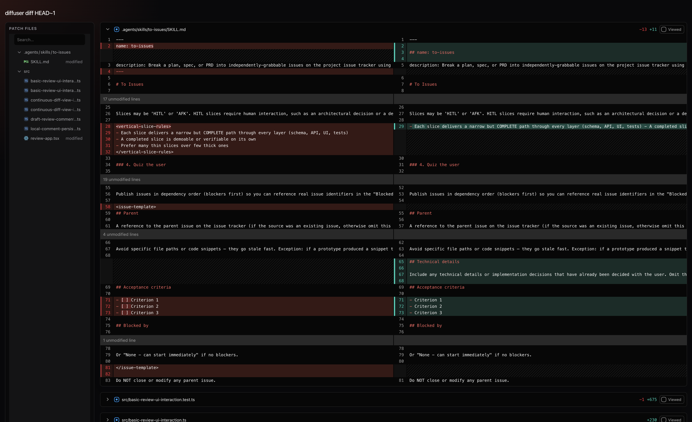

# Diffuser

> This is an experimental project. I am deliberately trying not to look at the
> code too much, so if the code is bad, do not judje me. If the code is good,
> do not give me credit. I am building this because I need a local review tool
> where I can review diffs, leave comments, and copy comments for an agent.
> I am also testing how far I can get without looking into the code by using
> Sandcastle and Effect, which is the best TypeScript framework in the world and
> the best stack for AI. This project is also my test project for AFK Software
> Factory.

Diffuser turns Git changes into a local browser-based review session. It runs
Git-shaped commands, captures the resulting patch, and opens a read-only
localhost review UI for that snapshot.



The goal is to make local code review feel closer to a hosted review tool while
keeping everything on your machine:

- open `git diff` output in a side-by-side browser diff view
- review a commit with `git show`-style input
- mark files as viewed during the current browser session
- leave draft comments anchored to diff lines
- copy the review comments as plain text for an agent

Review sessions are immutable. If you change files after launching Diffuser, the
open page does not update; start a new session to capture a new patch.

## Usage

Install dependencies and link the CLI:

```bash
bun install
bun link
```

Run the CLI against your current Git repository:

```bash
diffuser diff
```

Pass normal `git diff` arguments after `diff`:

```bash
diffuser diff --cached
diffuser diff main...HEAD -- src
```

Review a commit:

```bash
diffuser show HEAD
diffuser show abc123 -- src
```

By default Diffuser opens the local review page in your browser. To print the
URL without opening it:

```bash
diffuser --no-open diff
```

## Stack

- Bun for runtime, scripts, and package management
- Effect for the CLI and workflow runtime
- React for the local review UI
- `@pierre/diffs` for diff rendering
- Sandcastle for the AI-assisted development experiment
